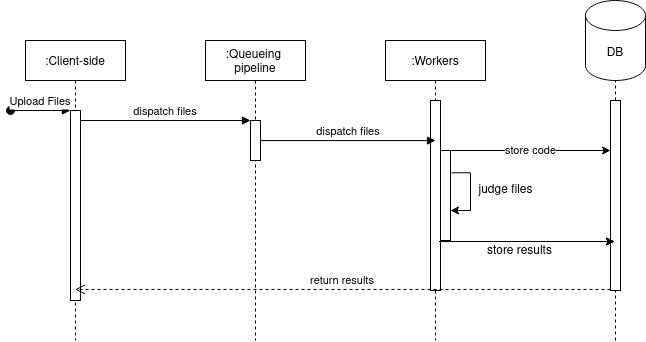

# Code Testing Pipeline


## Overview

The aim of this project is to create a web-based code testing platform for academic use. Users submit their code in a given language (here, Python) against a selected assignment, and are then provided with execution reports for a set of pre-defined test inputs.

## Functional Requirements

The application must:

1. Be capable of running user submitted code of a single given language in an isolated environment
2. Keep a record of
	1. The code submitted by a given user
	2. The status of each code execution
	3. The result of code execution
3. Instantiate a new environment for each submission, up to a given maximum number of parallel environments
4. De-instantiate an environment either:
	1. Post completed execution of the code
	2. In case execution time exceeds a given threshold
	3. Maintain a schedule of requested executions should the environment threshold be reached 
5. Provide to the user, 
	1. code execution output
	2. a means to retrieve this output at a later time
6. Provide to the system administrator, a unified dashboard of the status of all components


## Logical Flow



## Technology Stack

For this project the team elected to implement a full python stack, with the aim of benefitting from short time-to-product. Understanding that such an approach runs the risk of implementing synchronous code in key interfaces, we aimed to minimise this by selecting asynchronous interface libraries wherever possible.

| **Role** | **Tool** | **Advantages** | **Limitations** |
|-------|-----|------------|-------------|
|  **Web Server + Frontend**| Streamlit|Fast application deployment | Implicit creation of a websocket connection over HTTP. Creates its own health monitor which can ironically interfere with fault tolerance efforts |
| **Reverse Proxy** | NGINX | Industry standard, simple to implement, with good documentation | Features like sticky sessions which would be helpful to work around Streamlit behaviour are only present in the paid version
| **API Server** | FastAPI | Asynchronous API interface	| No major drawbacks|
| **Workflow Management**| Celery | Fork-friendly asynchronous task management | Poor documentation of distributed operation, despite supporting it. Extremely poor choice of name leads to recipes instead of documentation |
| **Message Queue**| RabbitMQ | Native support for workflow management without further configuration | No major drawbacks|
| **Database** | MongoDB | Fully satisfies entire DB requirement as all data is document driven | PyMongo is synchronous. Equivalent asynchronous library is not mature |
| **Orchestration** | Compose | Simple to deploy. Can trivially be run in swarm mode | Cannot autoscale. Session control features on par with Kubernetes only available in the paid version |


## How do we

### Handle user context

This implementation provides no means of authentication, user management, or session awareness. Instead, a ticket-based approach has been adopted whereby upon submission of a file, the user is provided with an alphabetic reference (e.g. "**XHBPQ**"), that can be used to identify their submission.


### Make the database fault tolerant

MongoDB has been implemented as a replicaset (```dbrs```) with a Primary-Secondary-Arbiter configuration.


### Make the workflow management scalable

Celery has been implemented in a microservices manner, with 3 worker containers defined, namely 
1. ```testcaller``` - Called by the API server upon code submission. Reads test cases corresponding to the submission, then adds 1 task to `dbhandler`, and *N* tasks to `testrunner`, where *N* is the number of test cases to run
2. ```testrunner``` - Executes a single test case with the provided code, test inputs, and expected outputs, then returns either output or traceback. Auto-fails at 10 seconds to prevent resource hogging, with appropriate feedback. Execution output is finally written to the database, resulting in *N* discrete updates.
3. ```dbhandler``` - Handles updating the database with test cases corresponding to a given submission

Each of these containers can be replicated arbitrarily. Each `testrunner` container has been set to autoscale the number of concurrent tasks between 0 and 10.


### Make the webserver fault tolerant

Streamlit's internal mechanisms interfere with 
1. Replication behind a reverse proxy - File uploads take place over HTTP while the session is created over websocket. This causes requests sent to a round-robin proxy to be sent to a wrong container, resulting in a 400 error
2. Graceful handover - When multiple containers are defined as servers for loadbalancing purposes, killing the active container **will not** immediately result in handover after refresh.

A workaround was found whereby the streamlit containers are added to the reverse proxy in either a primary-backup configuration or using `ip_hash`. This allows for eventual failover should the primary crash. However, due to Streamlit's internal health check, this process takes an unreasonable 10+ seconds to restore. Further, NGINX does not auto-discover restarted containers, resulting in a maximum *N-1* failure tolerance. 

### Actually run the submitted code

In each `testrunner` :

`subprocess.run(['python3','somecodefile.py',args...])`

This method makes an implicit assumption that the output of the program is printed to `stdout`. We believe that this is a reasonable assumption to make, as typical program execution reserves non-zero return values for errors. Further, this assumes that no unit test framework is in use. For complex programs, this approach may be extended by providing labelled prints.


#### How could this work for compiled languages?

In order to prevent transmitting binary blobs over RabbitMQ a combined worker would need to be defined.

In `testcaller_compiled`:
`subprocess.run(['gcc','somecodefile.c','-o', 'somecodefile'])`

Then, within `testcaller_compiled`
`testcaller_compiled.apply_async('testrunner_compiled',test_case_json)`
where `testrunner_compiled` is contained within the same worker, and operates on the binary `somecodefile`


## Would we use this in production

| **Tool** | **Production ready?** | **Why?** |
|-----|------------|-------------|
| Streamlit| No | Can scale by (bad) replication for anything that does not require file upload. Implementation team does not believe this is a priority bug to fix |
| NGINX | Yes | Alternatives require significantly more configuration| 
| FastAPI | Yes | It just works |
| Celery | Yes* | Once a distributed reference example was found, the implementation was trivial. New worker types are easy to add and send tasks to. However, the documentation itself does not show such examples.|
| RabbitMQ | Yes | It just works |
| MongoDB | Yes | It just works |
| Compose/Swarm | No | Not actually designed to scale. Configurations that would be trivial in Kubernetes (e.g. sticky sessions) have no free equivalents. Automatic service scaling is nonexistent, and would require significant hackery to implement manually. |